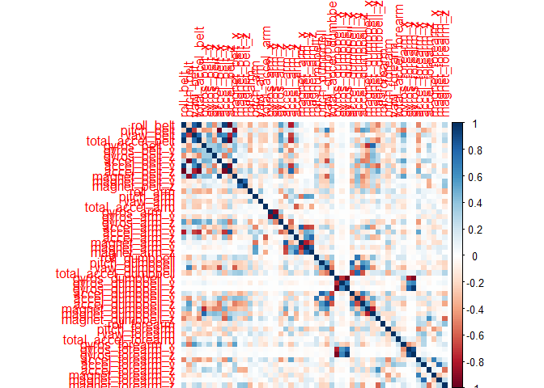
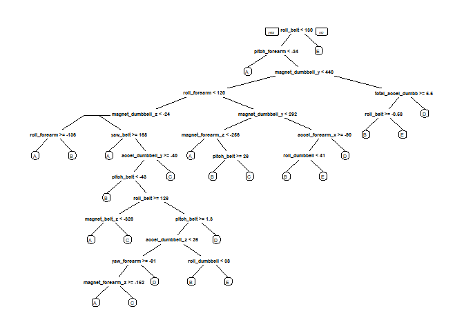

# PredictionAssignmentWriteup
Tai Chee Ming  
27 September 2017  

##Background

Using devices such as Jawbone Up, Nike FuelBand, and Fitbit it is now possible to collect a large amount of data about personal activity relatively inexpensively. These type of devices are part of the quantified self movement a group of enthusiasts who take measurements about themselves regularly to improve their health, to find patterns in their behavior, or because they are tech geeks. One thing that people regularly do is quantify how much of a particular activity they do, but they rarely quantify how well they do it. In this project, your goal will be to use data from accelerometers on the belt, forearm, arm, and dumbell of 6 participants. They were asked to perform barbell lifts correctly and incorrectly in 5 different ways. More information is available from the website here: http://web.archive.org/web/20161224072740/http:/groupware.les.inf.puc-rio.br/har (see the section on the Weight Lifting Exercise Dataset).


###Set working directory

```r
setwd('D:/Downloads/Coursera/Practical Machine Learning/Prediction Assignment Writeup')
```

###Insert libraries

```r
library(caret)
library(rpart)
library(rpart.plot)
library(randomForest)
library(corrplot)
```

###Download & Process the data

```r
trainingUrl <-"https://d396qusza40orc.cloudfront.net/predmachlearn/pml-training.csv"
testingUrl <- "https://d396qusza40orc.cloudfront.net/predmachlearn/pml-testing.csv"
trainingFile <- "./data/pml-training.csv"
testingFile  <- "./data/pml-testing.csv"
if (!file.exists("./data")) {
  dir.create("./data")
}
if (!file.exists(trainingFile)) {
  download.file(trainingUrl, destfile=trainingFile)
}
if (!file.exists(testingFile)) {
  download.file(testingUrl, destfile=testingFile)
}
```

###Read the 2 CSV files

```r
trainingRaw <- read.csv("./data/pml-training.csv")
testingRaw <- read.csv("./data/pml-testing.csv")
```

###Explore the size of both dataset

```r
dim(trainingRaw); dim(testingRaw)
```

```
## [1] 19622   160
```

```
## [1]  20 160
```
The trainingRaw has 19622 observations and the testingRaw has 20 observations. Both datasets have 160 variables. 

###Data clean up
Next, we have to clean up the trainingRaw dataset to make it suitable for machine learning which is to minimise inconsistency. However, we have to take note that the "classe" variable in the training set is the result we try to predict the testing data and we will not be removing it from the training data. However, we will take it out of the raw data before we do the data cleaning and put it back after we clean up the other variables. 

```r
trainingRaw <- trainingRaw[, colSums(is.na(trainingRaw)) == 0] 
testingRaw <- testingRaw[, colSums(is.na(testingRaw)) == 0] 
classe <- trainingRaw$classe
trainingRemove <- grepl("^X|timestamp|window", names(trainingRaw))
trainingRaw <- trainingRaw[, !trainingRemove]
trainingCleaned <- trainingRaw[, sapply(trainingRaw, is.numeric)]
trainingCleaned$classe <- classe
testingRemove <- grepl("^X|timestamp|window", names(testingRaw))
testingRaw <- testingRaw[, !testingRemove]
testingCleaned <- testingRaw[, sapply(testingRaw, is.numeric)]
```

###Split the trainingCleaned data
We are using the createDataPartition command to split the trainingCleaned data. The ideal ratio that we like to have is 70% to be used in training and the remaining to be used as for testing. Do not be mistaken that with the testingCleaned data as it is used to validate our findings. At the same time, we are setting the seed at 1 in order to reproduce it later.

```r
set.seed(1)
inTrain <- createDataPartition(trainingCleaned$classe, p=0.70, list=F)
trainingData <- trainingCleaned[inTrain, ]
testingData <- trainingCleaned[-inTrain, ]
```

##Data modeling

We will be using Random forest algorithm to predict the activity recognision. as it selects the variables by looking at the correlated elements in the dataset. We will also be using a 5-fold cross validation when we apply the algorithm. 

```r
controlRf <- trainControl(method="cv", 5)
modelRf <- train(classe ~ ., data=trainingData, method="rf", trControl=controlRf, ntree=250)
modelRf
```

```
## Random Forest 
## 
## 13737 samples
##    52 predictor
##     5 classes: 'A', 'B', 'C', 'D', 'E' 
## 
## No pre-processing
## Resampling: Cross-Validated (5 fold) 
## Summary of sample sizes: 10990, 10990, 10989, 10990, 10989 
## Resampling results across tuning parameters:
## 
##   mtry  Accuracy   Kappa    
##    2    0.9900267  0.9873827
##   27    0.9903909  0.9878443
##   52    0.9828929  0.9783584
## 
## Accuracy was used to select the optimal model using  the largest value.
## The final value used for the model was mtry = 27.
```

We are applying the modelRf to predict the testingData. 

```r
predictRf <- predict(modelRf, testingData)
confusionMatrix(testingData$classe, predictRf)
```

```
## Confusion Matrix and Statistics
## 
##           Reference
## Prediction    A    B    C    D    E
##          A 1669    2    2    0    1
##          B    6 1131    1    1    0
##          C    0    5 1018    3    0
##          D    0    0    4  958    2
##          E    0    1    1    3 1077
## 
## Overall Statistics
##                                           
##                Accuracy : 0.9946          
##                  95% CI : (0.9923, 0.9963)
##     No Information Rate : 0.2846          
##     P-Value [Acc > NIR] : < 2.2e-16       
##                                           
##                   Kappa : 0.9931          
##  Mcnemar's Test P-Value : NA              
## 
## Statistics by Class:
## 
##                      Class: A Class: B Class: C Class: D Class: E
## Sensitivity            0.9964   0.9930   0.9922   0.9927   0.9972
## Specificity            0.9988   0.9983   0.9984   0.9988   0.9990
## Pos Pred Value         0.9970   0.9930   0.9922   0.9938   0.9954
## Neg Pred Value         0.9986   0.9983   0.9984   0.9986   0.9994
## Prevalence             0.2846   0.1935   0.1743   0.1640   0.1835
## Detection Rate         0.2836   0.1922   0.1730   0.1628   0.1830
## Detection Prevalence   0.2845   0.1935   0.1743   0.1638   0.1839
## Balanced Accuracy      0.9976   0.9956   0.9953   0.9958   0.9981
```

###Sums up the numbers

```r
accuracy <- postResample(predictRf, testingData$classe)
accuracy
```

```
##  Accuracy     Kappa 
## 0.9945624 0.9931221
```

```r
outofsampleerror <- 1 - as.numeric(confusionMatrix(testingData$classe, predictRf)$overall[1])
outofsampleerror
```

```
## [1] 0.005437553
```
The training model that we selected gave us an accuracy of 99.45% and a out of sample error of 0.54%

##Using the result to predict the testingCleaned dataset

```r
FinalResult <- predict(modelRf, testingCleaned[, -length(names(testingCleaned))])
FinalResult
```

```
##  [1] B A B A A E D B A A B C B A E E A B B B
## Levels: A B C D E
```

#Appendix
Correlation Matrix Visualization

```r
corr <- cor(trainingData[, -length(names(trainingData))])
corrplot(corr, method="color")
```

<!-- -->


Decision Tree Visualization

```r
tree <- rpart(classe ~ ., data=trainingData, method="class")
prp(tree)
```

<!-- -->


